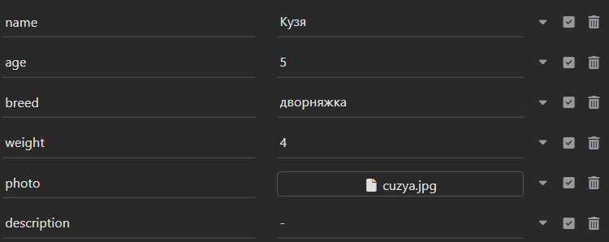
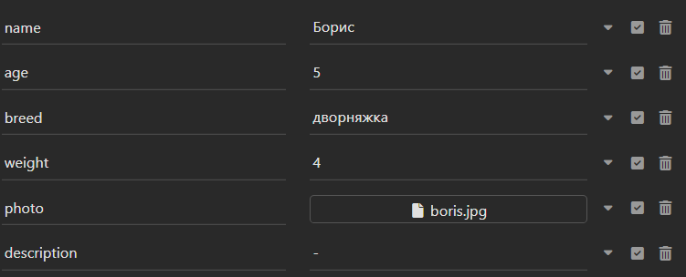

# cat_book - Проект Книга Котов - Бэкенд Сервис, где зарегистрированные и авторизированные пользователи могут добавлять, удалять, редактировать своих котов. Все пользователи могут просматривать котов.

# cats - пакет взаимодействия с котами

# Модули:

- ## `view.py` - модуль представлений
    - ## Классы:
        - ### `CatsApiList` - Показывает всех загруженных котов
        - ### `CatsApiRetrieve` - Показывает одного конкретного кота
        - ### `CatsApiCreate` - Добавляет кота
        - ### `CatsApiDestroy` - Удаляет кота
        - ### `CatsApiUpdate` - Обновляет кота

- ## `models.py` - модуль с моделями
    - ## Классы:
        - ### `Cats` - Модель Кот (с полями: имя, возраст, порода, вес, фото, описание, автор)

- ## `permissions` - модуль ограничений
    - ## Классы:
        - ### `IsOwnerOrAdmin` - Установка прав доступа: 'Для владельца' или 'Для админа'

- ## `serializer` - модуль форм
    - ## Классы:
        - ### `CatsSerializer` - Сериализатор кота

# users - пакет взаимодействия с пользователями

# Модули:

- ## `view.py` - модуль представлений
    - ## Классы:
        - ### `UserByTokenApi` - Просмотр информации о пользователе по токену


## Список `api/cats` запросов: 

### 1) `cat_list/` - Показывает всех загруженных котов
- GET:
- Пример ответа:
```
    [{
		"id": 1,
		"author": "admin",
		"name": "Бруно",
		"age": 66,
		"breed": "британский вислоухий кот",
		"weight": 5,
		"photo": "http://127.0.0.1:8000/media/photos/bruno.jpg",
		"description": "-"
	},
	{
		"id": 2,
		"author": "roman",
		"name": "Борис",
		"age": 5,
		"breed": "дворняжка",
		"weight": 4,
		"photo": "http://127.0.0.1:8000/media/photos/boris_8YW1DNY.jpg",
		"description": "-"
	},
	{
		"id": 4,
		"author": "roman",
		"name": "Кузя",
		"age": 5,
		"breed": "дворняжка",
		"weight": 4,
		"photo": "http://127.0.0.1:8000/media/photos/cuzya_zGjsERE.jpg",
		"description": "-"
	}]
```
### 2) `add_cat/` - Добавляет кота
- POST
- Пример тела запроса (через multipart / form):

- Пример ответа:
```
    {
	"id": 4,
	"author": "roman",
	"name": "Кузя",
	"age": 5,
	"breed": "дворняжка",
	"weight": 4,
	"photo": "http://127.0.0.1:8000/media/photos/cuzya_zGjsERE.jpg",
	"description": "-"
    }
```

### 3) `< int:pk >/` - Показывает одного конкретного кота
- GET (http://127.0.0.1:8000/api/cats/1/) 
- Пример ответа:
```
    {
	"id": 1,
	"author": "admin",
	"name": "Бруно",
	"age": 4,
	"breed": "британский вислоухий кот",
	"weight": 4,
	"photo": "http://127.0.0.1:8000/media/photos/bruno_uFspU3O.jpg",
	"description": "-"
    }
```
### 4) `< int:pk >/upd_cat/` - Обновляет кота
- PUT (http://127.0.0.1:8000/api/cats/2/upd_cat/)
- Пример тела запроса (через multipart / form):

- Пример ответа:
```
    {
	"id": 2,
	"author": "roman",
	"name": "Борис",
	"age": 5,
	"breed": "дворняжка",
	"weight": 4,
	"photo": "http://127.0.0.1:8000/media/photos/boris_g7dyNpj.jpg",
	"description": "-"
    }
```
### 5) `< int:pk >/del_cat/ ` - Удаляет кота
- DELETE (http://127.0.0.1:8000/api/cats/5/del_cat)

## Список `/auth` запросов: 
- ### `/auth/registration/users/` - Регистрация пользователя
- GET (все зарегистрированные пользователи (для админа))

- POST
- Пример тела запроса:
```
    {
	"username": "sergei",
	"password": "3e4r5tert",
	"email": "sergei@mail.ru"
    }
```
- Пример ответа:
```
    {
	"email": "sergei@mail.ru",
	"username": "sergei",
	"id": 8
    }
```

- ### `/token/login/` - Авторизация пользователя
- POST
- Пример тела запроса:
```
    {
	"username": "roman",
	"password": "1q2w3eqwe"
    }
```
- Пример ответа:
```
    {
	"auth_token": "20405b82f4e6533d1eb40e75ce9f6471329eabb1"
    }
```
- ### `/token/logout/` - Выход пользователя
- POST (необходимо указать токен в headers)

- ### `/user/by/token/` - получение данных пользователя по токену
- GET (необходимо указать токен в headers)
- Пример ответа:
```
    {
	"id": "2",
	"username": "roman"
    }
```


p.s. Для действий доступных авторизованному пользователю 
необходимо всегда в headers указывать `Authorization` `Token <значение токена>`

[//]: # (# ЗАПУСК:)

[//]: # (- ## Локальный запуск: http://127.0.0.1:8000/cats/)

[//]: # (- ## Запуск на сервере: https://catmanager-production.up.railway.app/cats/)

[//]: # (- ## Запуск через докер: &#40;поддерживает только локальный url&#41;)

[//]: # (  - ## 1&#41; Сборка - `docker-compose build`)

[//]: # (  - ## 2&#41; Запуск - `docker-compose up`)